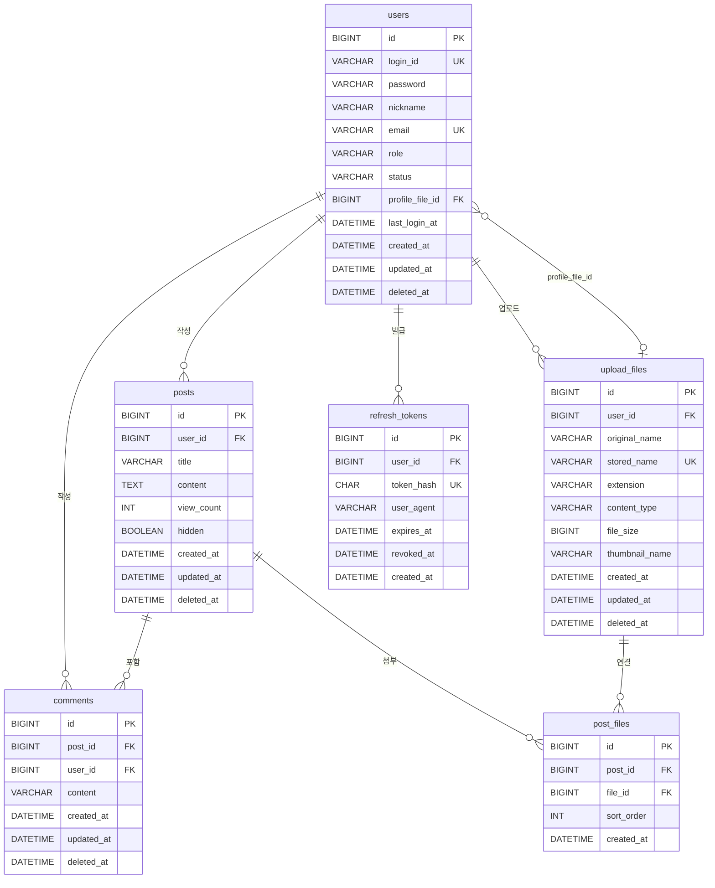

# 01. ERD (테이블 정의)

DB: MySQL 8.4 / charset `utf8mb4` / collation `utf8mb4_0900_ai_ci`
원본 DDL: [sql/schema.sql](sql/schema.sql), 샘플 데이터: [sql/seed_data.sql](sql/seed_data.sql)

## ERD 다이어그램

공통 규칙: `created_at`/`updated_at`은 모든 테이블(단, `post_files`/`refresh_tokens`는 수정 개념이 없어 `updated_at` 없음)에 존재. `deleted_at`이 있는 테이블은 하드 삭제 대신 소프트 삭제를 사용.

---

## users (회원)

| 컬럼 | 타입 | NULL | 기본값 | 설명 |
|---|---|---|---|---|
| id | BIGINT | N | AUTO_INCREMENT | 회원 ID (PK) |
| login_id | VARCHAR(20) | N | | 로그인 아이디 (UNIQUE) |
| password | VARCHAR(100) | N | | BCrypt 해시 |
| nickname | VARCHAR(20) | N | | 닉네임 |
| email | VARCHAR(100) | N | | 이메일 (UNIQUE) |
| role | VARCHAR(20) | N | `USER` | 권한: `USER`, `ADMIN` |
| status | VARCHAR(20) | N | `ACTIVE` | 상태: `ACTIVE`, `SUSPENDED`, `WITHDRAWN` |
| profile_file_id | BIGINT | Y | | 프로필 이미지 파일 ID (FK → upload_files.id) |
| last_login_at | DATETIME(6) | Y | | 마지막 로그인 일시 |
| created_at | DATETIME(6) | N | | 가입 일시 |
| updated_at | DATETIME(6) | N | | 수정 일시 |
| deleted_at | DATETIME(6) | Y | | 탈퇴 일시 |

- PK: `id`
- UNIQUE: `uk_users_login_id (login_id)`, `uk_users_email (email)`
- INDEX: `idx_users_status_created (status, created_at)`
- `profile_file_id`는 DDL 상 FK 제약은 없음(순환 참조 회피 목적) — 애플리케이션 레벨에서 `upload_files.id` 참조를 보장

## upload_files (업로드 파일)

| 컬럼 | 타입 | NULL | 기본값 | 설명 |
|---|---|---|---|---|
| id | BIGINT | N | AUTO_INCREMENT | 파일 ID (PK) |
| user_id | BIGINT | N | | 업로드한 회원 ID (FK → users.id) |
| original_name | VARCHAR(255) | N | | 원래 파일명 |
| stored_name | VARCHAR(100) | N | | 서버 저장 파일명 (UUID, UNIQUE) |
| extension | VARCHAR(10) | N | | 확장자 |
| content_type | VARCHAR(100) | N | | MIME 타입 |
| file_size | BIGINT | N | | 파일 크기 (byte) |
| thumbnail_name | VARCHAR(100) | Y | | 썸네일 파일명 |
| created_at | DATETIME(6) | N | | 업로드 일시 |
| updated_at | DATETIME(6) | N | | 수정 일시 |
| deleted_at | DATETIME(6) | Y | | 삭제 일시 |

- PK: `id`
- UNIQUE: `uk_upload_files_stored_name (stored_name)`
- INDEX: `idx_upload_files_user_created (user_id, created_at)`
- FK: `fk_upload_files_user (user_id) → users(id)`

## posts (게시글)

| 컬럼 | 타입 | NULL | 기본값 | 설명 |
|---|---|---|---|---|
| id | BIGINT | N | AUTO_INCREMENT | 게시글 ID (PK) |
| user_id | BIGINT | N | | 작성자 회원 ID (FK → users.id) |
| title | VARCHAR(200) | N | | 제목 |
| content | TEXT | N | | 본문 |
| view_count | INT | N | `0` | 조회수 |
| hidden | BOOLEAN | N | `FALSE` | 관리자 숨김 여부 |
| created_at | DATETIME(6) | N | | 작성 일시 |
| updated_at | DATETIME(6) | N | | 수정 일시 |
| deleted_at | DATETIME(6) | Y | | 삭제 일시 |

- PK: `id`
- INDEX: `idx_posts_created (created_at)`, `idx_posts_user_created (user_id, created_at)`
- FK: `fk_posts_user (user_id) → users(id)`

## post_files (게시글 첨부파일)

| 컬럼 | 타입 | NULL | 기본값 | 설명 |
|---|---|---|---|---|
| id | BIGINT | N | AUTO_INCREMENT | ID (PK) |
| post_id | BIGINT | N | | 게시글 ID (FK → posts.id) |
| file_id | BIGINT | N | | 파일 ID (FK → upload_files.id) |
| sort_order | INT | N | `0` | 첨부 순서 |
| created_at | DATETIME(6) | N | | 등록 일시 |

- PK: `id`
- UNIQUE: `uk_post_files (post_id, file_id)`
- INDEX: `idx_post_files_file (file_id)`
- FK: `fk_post_files_post (post_id) → posts(id)`, `fk_post_files_file (file_id) → upload_files(id)`

## comments (댓글)

| 컬럼 | 타입 | NULL | 기본값 | 설명 |
|---|---|---|---|---|
| id | BIGINT | N | AUTO_INCREMENT | 댓글 ID (PK) |
| post_id | BIGINT | N | | 게시글 ID (FK → posts.id) |
| user_id | BIGINT | N | | 작성자 회원 ID (FK → users.id) |
| content | VARCHAR(1000) | N | | 댓글 내용 |
| created_at | DATETIME(6) | N | | 작성 일시 |
| updated_at | DATETIME(6) | N | | 수정 일시 |
| deleted_at | DATETIME(6) | Y | | 삭제 일시 |

- PK: `id`
- INDEX: `idx_comments_post_created (post_id, created_at)`, `idx_comments_user (user_id)`
- FK: `fk_comments_post (post_id) → posts(id)`, `fk_comments_user (user_id) → users(id)`

## refresh_tokens (리프레시 토큰)

| 컬럼 | 타입 | NULL | 기본값 | 설명 |
|---|---|---|---|---|
| id | BIGINT | N | AUTO_INCREMENT | 토큰 ID (PK) |
| user_id | BIGINT | N | | 회원 ID (FK → users.id) |
| token_hash | CHAR(64) | N | | 토큰의 SHA-256 해시 (UNIQUE) |
| user_agent | VARCHAR(255) | Y | | 로그인 기기 정보 |
| expires_at | DATETIME(6) | N | | 만료 일시 |
| revoked_at | DATETIME(6) | Y | | 폐기 일시 |
| created_at | DATETIME(6) | N | | 발급 일시 |

- PK: `id`
- UNIQUE: `uk_refresh_tokens_hash (token_hash)`
- INDEX: `idx_refresh_tokens_user (user_id)`, `idx_refresh_tokens_expires (expires_at)`
- FK: `fk_refresh_tokens_user (user_id) → users(id)`
